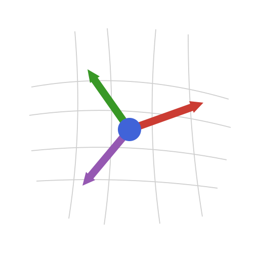

# TensND.jl

<p align="center">
  
</p>

*Symbolic and numerical tensor calculations in arbitrary coordinate systems.*

[](https://MicroPoroChemoMechanics.github.io/TensND.jl/stable/)
[](https://MicroPoroChemoMechanics.github.io/TensND.jl/dev/)

[](https://github.com/MicroPoroChemoMechanics/TensND.jl/actions/workflows/CI.yml)
[](https://codecov.io/gh/MicroPoroChemoMechanics/TensND.jl)

[](https://github.com/MicroPoroChemoMechanics/TensND.jl/blob/main/LICENSE)
[](https://github.com/fredrikekre/Runic.jl)

[](https://doi.org/10.5281/zenodo.17985768)

## Introduction

TensND.jl is a Julia package for tensor calculations of any order and dimension in arbitrary coordinate systems (cartesian, polar, cylindrical, spherical, spheroidal, or user-defined). It supports both **symbolic computation** (via [SymPy.jl](https://github.com/JuliaPy/SymPy.jl) and [Symbolics.jl](https://github.com/JuliaSymbolics/Symbolics.jl)) and **numerical evaluation** (via [ForwardDiff.jl](https://github.com/JuliaDiff/ForwardDiff.jl) automatic differentiation).

### Key features

- **Basis types**: canonical, rotated, orthogonal, and fully general (non-orthogonal, symbolic)
- **Tensor algebra**: products (`⊗`, `⊗ˢ`, `⊠`, `⊠ˢ`, `⋅`, `⊡`, `⊙`), change of basis, variance management
- **Structured tensors**: isotropic (`TensISO`), transversely isotropic (`TensTI{4}`, `TensTI`), orthotropic (`TensOrtho`) with compact storage and efficient algebra
- **Symmetry projection**: find the closest ISO, TI, or ORTHO tensor; rotation-optimized via [NLopt.jl](https://github.com/JuliaOpt/NLopt.jl)
- **Differential operators**: gradient, symmetric gradient, divergence, Laplacian, Hessian in curvilinear coordinates (symbolic and numerical)
- **Generic type system**: works with `Float64`, symbolic types (`Sym`, `Num`), and `ForwardDiff.Dual` for automatic differentiation

The implementation is inspired by the Maple library [Tens3d](http://jean.garrigues.perso.centrale-marseille.fr/tens3d.html) developed by Jean Garrigues.

The following example is provided to illustrate the purpose of the library

```julia
julia> using SymPy, TensND

julia> Spherical = coorsys_spherical() ; θ, ϕ, r = getcoords(Spherical) ; 𝐞ᶿ, 𝐞ᵠ, 𝐞ʳ = unitvec(Spherical) ;

julia> @set_coorsys Spherical

julia> GRAD(𝐞ʳ) |> intrinsic
(1/r)𝐞ᶿ⊗𝐞ᶿ + (1/r)𝐞ᵠ⊗𝐞ᵠ

julia> DIV(𝐞ʳ ⊗ 𝐞ʳ) |> intrinsic
(2/r)𝐞ʳ

julia> LAPLACE(1/r) |> intrinsic
0

julia> f = SymFunction("f", real = true)
f

julia> DIV(f(r) * 𝐞ʳ ⊗ 𝐞ʳ) |> intrinsic
(Derivative(f(r), r) + 2*f(r)/r)𝐞ʳ

julia> LAPLACE(f(r)) |> intrinsic
              d       
  2         2⋅──(f(r))
 d            dr
───(f(r)) + ──────────
  2             r
dr

julia> for σⁱʲ ∈ ("σʳʳ", "σᶿᶿ", "σᵠᵠ") @eval $(Symbol(σⁱʲ)) = SymFunction($σⁱʲ, real = true)($r) end

julia> 𝛔 = σʳʳ * 𝐞ʳ ⊗ 𝐞ʳ + σᶿᶿ * 𝐞ᶿ ⊗ 𝐞ᶿ + σᵠᵠ * 𝐞ᵠ ⊗ 𝐞ᵠ ; intrinsic(𝛔)
(σᶿᶿ(r))𝐞ᶿ⊗𝐞ᶿ + (σᵠᵠ(r))𝐞ᵠ⊗𝐞ᵠ + (σʳʳ(r))𝐞ʳ⊗𝐞ʳ

julia> div𝛔 = tsimplify(DIV(𝛔)) ; intrinsic(div𝛔)
((-σᵠᵠ(r) + σᶿᶿ(r))/(r*tan(θ)))𝐞ᶿ + ((r*Derivative(σʳʳ(r), r) + 2*σʳʳ(r) - σᵠᵠ(r) - σᶿᶿ(r))/r)𝐞ʳ
```

## Installation

TensND.jl is registered in Julia's General registry.

In Pkg REPL mode (press `]` in the Julia REPL):

```julia-repl
pkg> add TensND
```

Or via the `Pkg` API:

```julia
using Pkg
Pkg.add("TensND")
```

## Documentation

- [**STABLE**](https://MicroPoroChemoMechanics.github.io/TensND.jl/stable/) &mdash; **most recently tagged version of the documentation.**
- [**DEV**](https://MicroPoroChemoMechanics.github.io/TensND.jl/dev/) &mdash; **development version of the documentation.**

## Citation

[](https://doi.org/10.5281/zenodo.17985768)

If you use TensND.jl in your research, please cite it:

```bibtex
@software{barthelemy_tensnd,
  author    = {Barth{\'e}l{\'e}my, Jean-Fran{\c{c}}ois},
  title     = {{TensND.jl}: Package allowing tensor calculations in arbitrary coordinate systems},
  version   = {0.1.8},
  doi       = {10.5281/zenodo.17985768},
  url       = {https://doi.org/10.5281/zenodo.17985768},
  publisher = {Zenodo},
}
```

The [CITATION.cff](CITATION.cff) file is also available for tools such as [Zenodo](https://zenodo.org/) and [citeas.org](https://citeas.org/).

## Acknowledgements

Parts of this codebase were developed with the assistance of Anthropic's
*Claude Code*, under the author's review and numerical validation.
