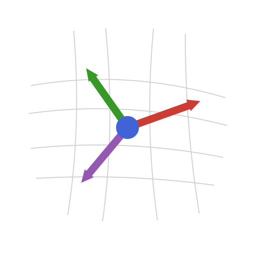

# TensND.jl

<p align="center">
  
</p>

*Symbolic and numerical tensor calculations in arbitrary coordinate systems.*

[](https://MicroPoroChemoMechanics.github.io/TensND.jl/stable/)
[](https://MicroPoroChemoMechanics.github.io/TensND.jl/dev/)

[](https://github.com/MicroPoroChemoMechanics/TensND.jl/actions/workflows/CI.yml)
[](https://codecov.io/gh/MicroPoroChemoMechanics/TensND.jl)

[](https://github.com/MicroPoroChemoMechanics/TensND.jl/blob/main/LICENSE)
[](https://github.com/fredrikekre/Runic.jl)

[](https://doi.org/10.5281/zenodo.17985768)

## Introduction

TensND.jl is a Julia package for tensor calculations of any order and dimension in arbitrary coordinate systems (cartesian, polar, cylindrical, spherical, spheroidal, or user-defined). It supports both **symbolic computation** (via [SymPy.jl](https://github.com/JuliaPy/SymPy.jl) and [Symbolics.jl](https://github.com/JuliaSymbolics/Symbolics.jl)) and **numerical evaluation** (via [ForwardDiff.jl](https://github.com/JuliaDiff/ForwardDiff.jl) automatic differentiation).

### Key features

- **Basis types**: canonical, rotated, orthogonal, and fully general non-orthogonal bases, with covariant/contravariant components and the metric that relates them
- **Tensor algebra**: products (`⊗`, `⊗ˢ`, `⊠`, `⊠ˢ`, `⋅`, `⊡`, `⊙`), change of basis, variance management
- **Structured tensors**: isotropic (`TensISO`), transversely isotropic (`TensTI`), orthotropic (`TensOrtho`) — 2, 5 and 9 stored scalars instead of 81 components, with closed-form products and inverses one to three orders of magnitude faster than the dense route
- **Symmetry projection**: closest ISO, TI or ORTHO tensor, with the orientation given or optimized via [NLopt.jl](https://github.com/JuliaOpt/NLopt.jl)
- **Differential operators**: `GRAD`, `SYMGRAD`, `DIV`, `LAPLACE`, `HESS` in curvilinear coordinates — symbolically (`CoorSystemSym`) or pointwise by automatic differentiation (`CoorSystemNum`), on orthogonal **and genuinely non-orthogonal** charts
- **Submanifolds**: embedded hypersurfaces (`SubManifoldSym`) with their first and second fundamental forms, connection coefficients and curvatures
- **Generic type system**: works with `Float64`, symbolic types (`Sym`, `Num`), and `ForwardDiff.Dual` for automatic differentiation

The implementation is inspired by the Maple library [Tens3d](http://jean.garrigues.perso.centrale-marseille.fr/tens3d.html) developed by Jean Garrigues.

The following example is provided to illustrate the purpose of the library

```julia
julia> using SymPy, TensND

julia> Spherical = coorsys_spherical() ; θ, ϕ, r = getcoords(Spherical) ; 𝐞ᶿ, 𝐞ᵠ, 𝐞ʳ = unitvec(Spherical) ;

julia> @set_coorsys Spherical

julia> GRAD(𝐞ʳ) |> pprint
(1/r)𝐞ᶿ⊗𝐞ᶿ + (1/r)𝐞ᵠ⊗𝐞ᵠ

julia> DIV(𝐞ʳ ⊗ 𝐞ʳ) |> pprint
(2/r)𝐞ʳ

julia> LAPLACE(1/r) |> pprint
0

julia> f = SymFunction("f", real = true)
f

julia> DIV(f(r) * 𝐞ʳ ⊗ 𝐞ʳ) |> pprint
(Derivative(f(r), r) + 2*f(r)/r)𝐞ʳ

julia> LAPLACE(f(r)) |> pprint
              d
 2          2⋅──(f(r))
d             dr
───(f(r)) + ──────────
  2             r
dr

julia> for σⁱʲ ∈ ("σʳʳ", "σᶿᶿ", "σᵠᵠ") @eval $(Symbol(σⁱʲ)) = SymFunction($σⁱʲ, real = true)($r) end

julia> 𝛔 = σʳʳ * 𝐞ʳ ⊗ 𝐞ʳ + σᶿᶿ * 𝐞ᶿ ⊗ 𝐞ᶿ + σᵠᵠ * 𝐞ᵠ ⊗ 𝐞ᵠ ; pprint(𝛔)
(σᶿᶿ(r))𝐞ᶿ⊗𝐞ᶿ + (σᵠᵠ(r))𝐞ᵠ⊗𝐞ᵠ + (σʳʳ(r))𝐞ʳ⊗𝐞ʳ

julia> div𝛔 = tsimplify(DIV(𝛔)) ; pprint(div𝛔)
((-σᵠᵠ(r) + σᶿᶿ(r))/(r*tan(θ)))𝐞ᶿ + ((r*Derivative(σʳʳ(r), r) + 2*σʳʳ(r) - σᵠᵠ(r) - σᶿᶿ(r))/r)𝐞ʳ
```

The last line is the equilibrium equation of a spherically symmetric stress state, derived rather than transcribed.

## Installation

TensND.jl is registered in Julia's General registry.

In Pkg REPL mode (press `]` in the Julia REPL):

```julia-repl
pkg> add TensND
```

Or via the `Pkg` API:

```julia
using Pkg
Pkg.add("TensND")
```

Add [NLopt.jl](https://github.com/JuliaOpt/NLopt.jl) as well to enable the orientation search of `proj_tens`, which is provided by a package extension:

```julia-repl
pkg> add NLopt
```

## Documentation

- [**STABLE**](https://MicroPoroChemoMechanics.github.io/TensND.jl/stable/) &mdash; **most recently tagged version of the documentation.**
- [**DEV**](https://MicroPoroChemoMechanics.github.io/TensND.jl/dev/) &mdash; **development version of the documentation.**

The documentation is organized as a reading path:

| Section | For |
| :--- | :--- |
| **Theory** | the mathematics the library implements — tensor algebra, bases and variance, Kelvin–Mandel, the Walpole basis, projection algorithms, curvilinear calculus, submanifolds — every formula cited, derived, or read off the implementation |
| **Manual** | how to call it, task by task |
| **Tutorials** | runnable scripts from [`scripts/`](scripts), each also published as a Jupyter notebook |
| **Developer** | the source layout, and how to extend it |
| **API** | every exported name, grouped by theme |

## Release notes

See [CHANGELOG.md](CHANGELOG.md). Three names have changed since v0.2.7, each keeping a deprecated alias that forwards:

| Was | Is | Since | Why |
| :--- | :--- | :--- | :--- |
| `Riemann(SM)` | `connection(SM)` | v0.3.0 | it returns the connection coefficients of the induced metric, never a Riemann curvature tensor |
| `intrinsic(t)` | `pprint(t)` | v0.3.0 | what it prints is explicitly *basis dependent*, the opposite of intrinsic |
| `print_tensor(t)` | `pprint(t)` | v0.3.1 | its fallback method accepts a **scalar**, so the name promised more than it delivered; `pprint` is the MPCM-wide name for a pretty-printer |

`@set_coorsys` no longer defines methods — it stores the default chart, alongside the new `set_coorsys!`, `default_coorsys` and `unset_coorsys!`. As a consequence `∂(t, x)` always means the plain derivative with respect to the symbol `x`; the covariant derivative is `∂(t, x, CS)`.

## Citation

[](https://doi.org/10.5281/zenodo.17985768)

If you use TensND.jl in your research, please cite it:

```bibtex
@software{barthelemy_tensnd,
  author    = {Barth{\'e}l{\'e}my, Jean-Fran{\c{c}}ois},
  title     = {{TensND.jl}: Package allowing tensor calculations in arbitrary coordinate systems},
  version   = {0.3.1},
  doi       = {10.5281/zenodo.17985768},
  url       = {https://doi.org/10.5281/zenodo.17985768},
  publisher = {Zenodo},
}
```

The [CITATION.cff](CITATION.cff) file is also available for tools such as [Zenodo](https://zenodo.org/) and [citeas.org](https://citeas.org/).

## Acknowledgements

Parts of this codebase were developed with the assistance of Anthropic's
*Claude Code*, under the author's review and numerical validation.
