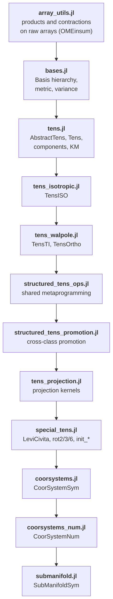

# [Architecture](@id dev-architecture)

How the source is organized, and why. Files are listed in the order
`src/TensND.jl` includes them, which is also their dependency order.

## The include chain

## Layers

**Raw arrays.** `array_utils.jl` implements every product as an OMEinsum
contraction code on `AbstractArray`s. It knows nothing about bases, and is
therefore generic in the element type by construction. Everything above it
inherits that genericity.

**Bases and tensors.** `bases.jl` and `tens.jl` add the basis and the variance.
The tensor type follows the basis type, which is what makes the cost of a
component conversion a property of the data rather than of the call site.

**Structured types.** `tens_isotropic.jl` and `tens_walpole.jl` store
coefficients instead of components and override the generic operations with
closed forms. `structured_tens_ops.jl` holds the metaprogramming they share —
every structured type exposes `get_data` and a `_rebuild`, and the shared code
generates the scalar arithmetic and the symbolic passes from those two.
`structured_tens_promotion.jl` handles mixed-class operations.

**Projection.** `tens_projection.jl` works entirely in the ``6\times6``
Kelvin–Mandel picture. The orientation search lives in the weak-dependency
extension `ext/TensNDNLoptExt.jl`, so `NLopt` is optional.

**Differential calculus.** `coorsystems.jl` (symbolic) and
`coorsystems_num.jl` (automatic differentiation) implement the same five
operators against the same accessor interface. `submanifold.jl` restricts the
construction to an embedded hypersurface.

## Two design decisions worth knowing

**Geometry and data have independent element types.** A `TensOrtho` carries its
material frame as a separate type parameter, so `Dual`-valued constants can sit
on a `Float64` frame. Forcing them to agree broke every attempt to differentiate
a scheme with respect to a modulus. The same reasoning applies to the symmetry
axis of a `TensTI` and to the frame passed to `proj_tens`, where converting the
frame to the field's element type once produced `NaN` derivatives — see the
comment in `proj_tens(::Val{:ORTHO}, …)`.

**Closed forms only while the result stays in the class.** The structured
methods return the generic tensor whenever the exact result leaves the class —
a product of two orthotropic tensors needs twelve constants, not nine. The
fallback is bit-for-bit the generic computation, never an approximation. The
full table is on [Structured tensors](@ref man-structured).

## The extension

`ext/TensNDNLoptExt.jl` overrides `TensND._proj_tens_opt`, the hook the
no-orientation methods of [`proj_tens`](@ref) dispatch to. Without `NLopt` those
methods throw a clear error; with it, they run the deterministic multi-start
described on [Projection onto a symmetry class](@ref th-projection).

Because loading `NLopt` **permanently** activates the extension for the session,
`test/test_nlopt_ext.jl` must run last: `test/test_tens_projection.jl` asserts
the no-NLopt behavior and would fail after it.
