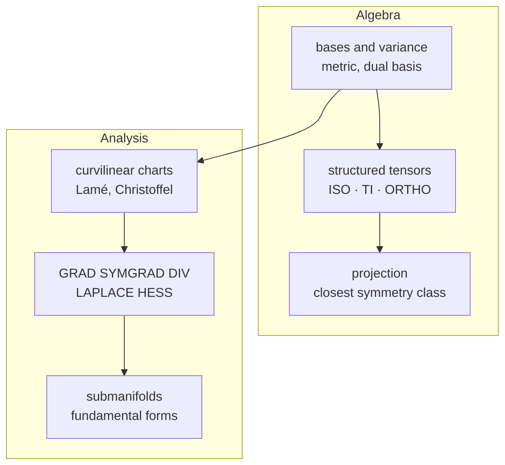

```@meta
CurrentModule = TensND
```

# TensND.jl


*Symbolic and numerical tensor calculations in arbitrary coordinate systems.*

Tensors of any order and dimension, on any basis, with exact symbolic
derivatives or automatic differentiation — and compact storage for the material
symmetry classes, where 81 components collapse to a handful of scalars.

## What it does



- **Bases** — canonical, rotated, orthogonal or fully general, with covariant
  and contravariant components and the metric that relates them.
- **Tensor algebra** — ``\otimes``, ``\stackrel{s}{\otimes}``, ``\boxtimes``,
  ``\stackrel{s}{\boxtimes}``, and contractions of one, two or four indices.
- **Structured types** — [`TensISO`](@ref), [`TensTI`](@ref),
  [`TensOrtho`](@ref) store 2, 5 and 9 scalars and compute products and inverses
  in closed form, one to three orders of magnitude faster than the dense route.
- **Symmetry projection** — the closest isotropic, transversely isotropic or
  orthotropic tensor, with the orientation given or optimized.
- **Differential operators** in curvilinear coordinates, symbolically or by
  automatic differentiation, plus embedded surfaces.
- **One generic implementation** for `Float64`, `ForwardDiff.Dual`, `SymPy.Sym`
  and `Symbolics.Num`.

The design is inspired by the Maple library
[Tens3d](http://jean.garrigues.perso.centrale-marseille.fr/tens3d.html) of Jean
Garrigues.

## A taste

```@example home
using TensND, SymPy

Spherical = coorsys_spherical()
θ, ϕ, r = getcoords(Spherical)
𝐞ᶿ, 𝐞ᵠ, 𝐞ʳ = unitvec(Spherical)
@set_coorsys Spherical

σʳʳ = SymFunction("σʳʳ", real = true)(r)
σᶿᶿ = SymFunction("σᶿᶿ", real = true)(r)
𝛔 = σʳʳ * 𝐞ʳ ⊗ 𝐞ʳ + σᶿᶿ * (𝐞ᶿ ⊗ 𝐞ᶿ + 𝐞ᵠ ⊗ 𝐞ᵠ)

pprint(DIV(𝛔))
```

The equilibrium equation of a spherically symmetric stress state, derived rather
than transcribed.

## Installation

```julia
julia> import Pkg; Pkg.add("TensND")
```

Add `NLopt` as well to enable the orientation search of
[`proj_tens`](@ref) — see [Installation](@ref man-installation).

## Reading path

| Section | For |
| :--- | :--- |
| [Theory](@ref th-index) | the mathematics the library implements, stated once and cited |
| [Manual](@ref man-getting-started) | how to call it, task by task |
| [Tutorials](@ref tut-index) | runnable scripts, each also a notebook |
| [Developer](@ref dev-architecture) | the source layout, and how to extend it |
| [API](@ref api-index) | every exported name, grouped by theme |

Newcomers should start with [Getting started](@ref man-getting-started), then
the tutorial [Bases, variance and the metric](@ref) — variance is the one notion
a Cartesian-only tensor library does without, and everything else rests on it.

## Citing

```bibtex
@misc{TensND.jl,
  author  = {Jean-François Barthélémy},
  title   = {TensND.jl: symbolic and numerical tensor calculations
             in arbitrary coordinate systems},
  url     = {https://github.com/MicroPoroChemoMechanics/TensND.jl},
  doi     = {10.5281/zenodo.17985768},
  year    = {2026}
}
```

`CITATION.cff` in the repository root carries the same metadata in a
machine-readable form. Works cited by this documentation are collected on the
[References](@ref references) page.

## Related packages

| Package | Role here |
| :--- | :--- |
| [Tensors.jl](https://github.com/Ferrite-FEM/Tensors.jl) | low-level storage for small tensors |
| [OMEinsum.jl](https://github.com/under-Peter/OMEinsum.jl) | the contraction engine |
| [SymPy.jl](https://github.com/JuliaPy/SymPy.jl) | symbolic backend |
| [Symbolics.jl](https://github.com/JuliaSymbolics/Symbolics.jl) | native Julia CAS backend |
| [Rotations.jl](https://github.com/JuliaGeometry/Rotations.jl) | rotation representations |
| [ForwardDiff.jl](https://github.com/JuliaDiff/ForwardDiff.jl) | automatic differentiation |
| [NLopt.jl](https://github.com/JuliaOpt/NLopt.jl) | optional, orientation search |
