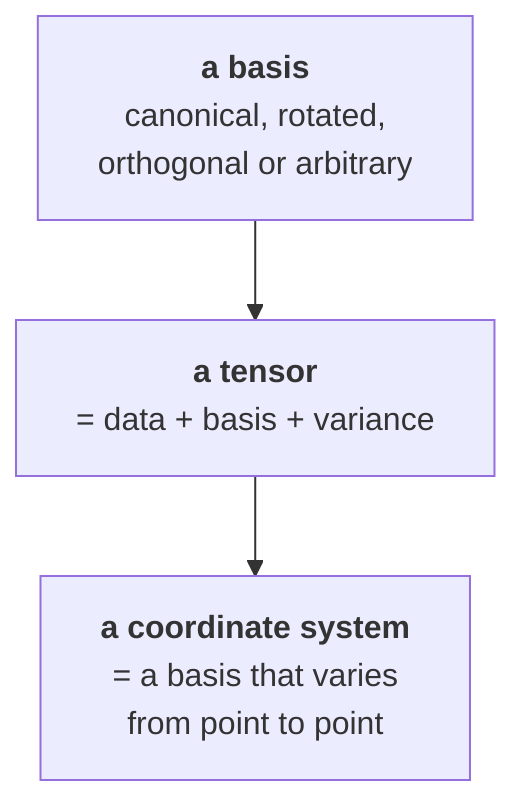

# [Getting started](@id man-getting-started)

A guided tour of the library in one page. Each step links to the manual chapter
that develops it and to the theory behind it.

## The three objects

`TensND` is built on three things, in this order:



A **tensor** is not an array: it is an array *together with* the basis its
components refer to and the variance of each index. That is what allows two
tensors expressed in different frames to be added, contracted or compared —
and what makes comparing raw component arrays a mistake.

## A first computation

```@example gs
using TensND, SymPy

Spherical = coorsys_spherical()
θ, ϕ, r = getcoords(Spherical)
𝐞ᶿ, 𝐞ᵠ, 𝐞ʳ = unitvec(Spherical)
@set_coorsys Spherical

DIV(𝐞ʳ)
```

The radial unit vector has constant components `(0,0,1)` in the spherical frame,
yet its divergence is ``2/r``: the whole answer comes from the frame varying
with position, through the Christoffel symbols
([Curvilinear differential calculus](@ref th-curvilinear)).

The kernel of the Laplace equation, and the equilibrium operator of a spherically
symmetric stress state:

```@example gs
LAPLACE(1 / r)
```

```@example gs
σʳʳ = SymFunction("σʳʳ", real = true)(r)
σᶿᶿ = SymFunction("σᶿᶿ", real = true)(r)
𝛔 = σʳʳ * 𝐞ʳ ⊗ 𝐞ʳ + σᶿᶿ * (𝐞ᶿ ⊗ 𝐞ᶿ + 𝐞ᵠ ⊗ 𝐞ᵠ)
simplify(DIV(𝛔))
```

## Structured tensors

An isotropic order-4 tensor is stored as two scalars, not 81 components, and its
algebra stays closed:

```@example gs2
using TensND

ℂ = TensISO{3}(3 * 20.0, 2 * 8.0)      # 3k 𝕁 + 2μ 𝕂
inv(ℂ)
```

Transverse isotropy uses five coefficients on the Walpole basis
([The Walpole basis](@ref th-walpole)), orthotropy nine plus a material frame:

```@example gs2
n = [0.0, 0.0, 1.0]
𝕊 = tens_TI_eng(9.0, 140.0, 0.40, 0.30, 4.6, n)   # a carbon/epoxy ply
arg_TI_Hoenig(𝕊)
```

The dimensionless Hoenig parameters read off the anisotropy directly — see
[TI parametrizations](@ref th-ti-parametrizations).

## Finding a symmetry

Given an arbitrary tensor, ask what symmetry it has:

```@example gs2
C = get_array(tens_TI(10.0, 3.0, 2.5, 12.0, 2.0, [0.0, 0.0, 1.0]))
_, _, drel, sym = best_sym_tens(Tens(C))
(sym, drel)
```

and project onto a class, with the distance as evidence:

```@example gs2
B, d, drel = proj_tens(:ISO, C)
(B, round(drel, digits = 4))
```

`drel` is the *relative* Frobenius distance, so a tolerance on it is
dimensionless. See [Projection](@ref man-projection).

## Where to go next

| If you want to | Read |
| :--- | :--- |
| understand what a basis and a variance are | [Bases](@ref man-bases), [Bases and variance](@ref th-bases-variance) |
| build and manipulate tensors | [Tensors](@ref man-tensors) |
| use the compact symmetry-class types | [Structured tensors](@ref man-structured) |
| convert between TI parametrizations | [Parametrizations](@ref man-parametrizations) |
| find or impose a material symmetry | [Projection](@ref man-projection) |
| differentiate fields on a curvilinear chart | [Coordinate systems](@ref man-coorsystems) |
| do the same numerically, by AD | [Numerical coordinate systems](@ref man-coorsystems-num) |
| work on an embedded surface | [Submanifolds](@ref man-submanifolds) |
| mix symbolic, numeric and AD types | [Symbolic and numeric](@ref man-symbolic-numeric) |

The [Tutorials](@ref tut-index) are runnable versions of all of the above, and
the [Theory](@ref th-index) section states the mathematics each rests on.
