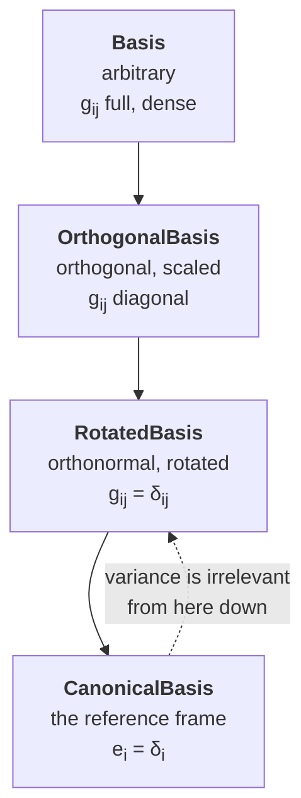

# [Bases and variance](@id th-bases-variance)

This is the one chapter with no counterpart in the
[Echoes manual](https://jfbarthelemy.github.io/echoes/), which works exclusively
in an orthonormal frame and states outright that "introducing the notion of
tensor variance is useless here". `TensND` does not make that assumption: a
tensor carries a basis, which may be arbitrary, and a **variance** tuple saying
how each of its indices transforms. Everything below is derived from the
definitions and matches `src/bases.jl`.

## Dual basis and metric

Let ``(\underline{e}_i)_{i=1..d}`` be a basis of ``\mathbb{R}^d``, not
necessarily orthogonal or normalized. The **dual** (reciprocal) basis
``(\underline{e}^i)`` is defined by

```math
\underline{e}^i\cdot\underline{e}_j=\delta^i_j .
```

The two **metric** matrices are the Gram matrices of each basis,

```math
g_{ij}=\underline{e}_i\cdot\underline{e}_j,
\qquad
g^{ij}=\underline{e}^i\cdot\underline{e}^j,
\qquad\text{and consequently}\qquad
g^{ik}g_{kj}=\delta^i_j ,
```

so that ``[g^{ij}]=[g_{ij}]^{-1}``. They raise and lower indices, and convert
between the two bases:

```math
\underline{e}^i=g^{ij}\underline{e}_j,
\qquad
\underline{e}_i=g_{ij}\underline{e}^j .
```

## Variance of components

A vector has two equally legitimate sets of components,

```math
\underline{u}=u^i\,\underline{e}_i=u_i\,\underline{e}^i,
\qquad
u^i=\underline{u}\cdot\underline{e}^i,
\quad
u_i=\underline{u}\cdot\underline{e}_i,
\qquad
u^i=g^{ij}u_j .
```

``u^i`` are the **contravariant** components (`:cont`, the default in `TensND`)
and ``u_i`` the **covariant** ones (`:cov`). An order-``p`` tensor has one such
choice per index, hence a variance tuple of length ``p``; for an order-2 tensor
all four combinations exist:

```math
\boldsymbol{a}
= a^{ij}\,\underline{e}_i\otimes\underline{e}_j
= a_{ij}\,\underline{e}^i\otimes\underline{e}^j
= a^{i}{}_{j}\,\underline{e}_i\otimes\underline{e}^j
= a_{i}{}^{j}\,\underline{e}^i\otimes\underline{e}_j ,
```

related by the metric, ``a^{ij}=g^{ik}g^{jl}a_{kl}`` and so on. In `TensND` the
conversion is [`components`](@ref)`(t, var)`, or
[`change_tens`](@ref)`(t, ℬ, var)` when the basis changes too.

!!! note "Why an identity looks like a metric"
    Storing the covariant metric ``g_{ij}`` as a twice-covariant tensor and
    asking for its mixed components necessarily returns the identity, because
    ``g^{ik}g_{kj}=\delta^i_j``. That round trip is the example in the
    [`Tens`](@ref) docstring and the cheapest sanity check on a basis.

## Change of basis

If ``\underline{e}'_j=P^i{}_j\,\underline{e}_i`` — that is, ``P`` has the new
basis vectors as **columns** in the old basis — then components transform
*oppositely* to basis vectors for a contravariant index and *with* them for a
covariant one:

```math
u'^j=(P^{-1})^j{}_i\,u^i,
\qquad
u'_j=P^i{}_j\,u_i .
```

This contravariance/covariance split is exactly what the words name, and it is
what makes the distinction vanish for an orthonormal basis, where
``P^{-1}={}^{t}P`` and ``g_{ij}=g^{ij}=\delta_{ij}``.

## The four matrices of a `Basis`

`TensND` stores all four objects rather than recomputing them, because every
component conversion needs one of them:

| Stored matrix | Symbol | Meaning |
| :------------ | :----- | :------ |
| `vecbasis(ℬ, :cov)` | ``[\underline{e}_i]`` | columns = basis vectors in the canonical basis |
| `vecbasis(ℬ, :cont)` | ``[\underline{e}^i]`` | columns = dual basis vectors |
| `metric(ℬ, :cov)` | ``[g_{ij}]`` | covariant metric |
| `metric(ℬ, :cont)` | ``[g^{ij}]`` | contravariant metric, ``=[g_{ij}]^{-1}`` |

## The basis hierarchy

The more structure a basis has, the less of the above needs to be computed — so
the type of the basis fixes the cost of every operation on tensors expressed in
it, and the constructor [`Basis`](@ref) automatically returns the most specific
type that applies.



| Type | Metric | Dual basis | Variance matters? |
| :--- | :----- | :--------- | :---------------- |
| [`CanonicalBasis`](@ref) | ``\boldsymbol{1}`` | itself | no |
| [`RotatedBasis`](@ref) | ``\boldsymbol{1}`` | itself | no |
| [`OrthogonalBasis`](@ref) | ``\mathrm{diag}(\chi_i^2)`` | ``\underline{e}^i=\underline{e}_i/\chi_i^2`` | yes, but diagonally |
| [`Basis`](@ref) | full | ``[g^{ij}][\underline{e}_j]`` | yes |

`RotatedBasis` is built from one angle in 2-D or three Euler angles in 3-D (see
[Rotations](@ref th-rotations)); `OrthogonalBasis` from an orthonormal basis and
a tuple of scaling factors ``\chi_i``. Those ``\chi_i`` are precisely the **Lamé
coefficients** when the basis is the natural basis of a curvilinear coordinate
system — the link is made on
[Curvilinear differential calculus](@ref th-curvilinear).

Correspondingly, a tensor's type follows its basis' type: `Tens`,
`TensOrthogonal`, `TensRotated`, `TensCanonical`. Only the first two carry a
variance tuple.

## Normalization

Dividing each vector of a basis by its norm produces an orthogonal basis with
unit vectors, i.e. an orthonormal one if the original was orthogonal. This is
`LinearAlgebra.normalize``(ℬ)` and it is what relates the **natural**
basis of a coordinate system to its **normalized** basis — the distinction that
makes ``\mathrm{d}s = \chi_i\,\mathrm{d}q^i`` rather than ``\mathrm{d}q^i``, and
the source of every Lamé coefficient in
[Curvilinear differential calculus](@ref th-curvilinear).

For a general (non-orthogonal) basis, normalizing removes the scaling but not
the obliquity: the metric becomes a correlation matrix with unit diagonal, and
variance still matters.
