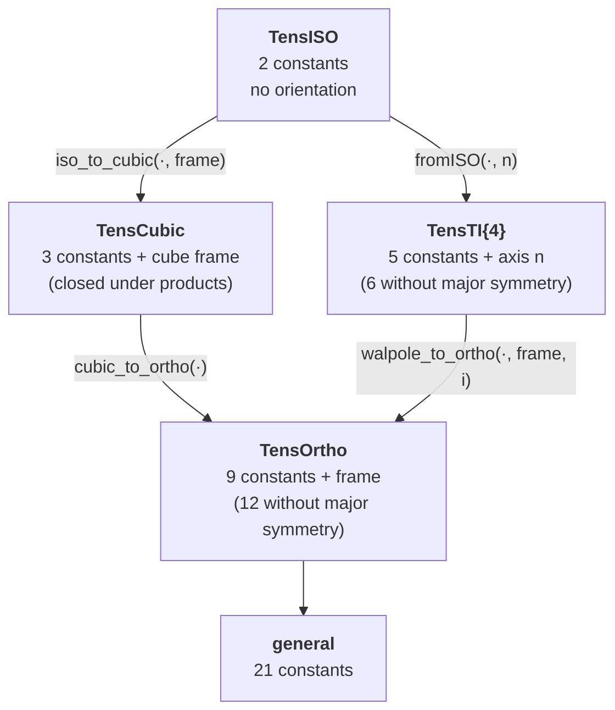

# [Cubic symmetry](@id th-cubic)

Cubic symmetry is invariance under the **octahedral group** ``O_h``: the 48
isometries of a cube. It is the class of a cubic crystal, of a cubic array of
inclusions, and of any body whose shape is left invariant by those isometries —
a supersphere, for instance.

`TensND` gives it a dedicated storage type ([`TensCubic`](@ref),
`src/tens_cubic.jl`): **three** constants plus a cube frame, against nine for
orthotropy and 21 for a general minor- and major-symmetric tensor.

It sits between the two classes it borrows from, and it is worth saying which
half comes from where. Its *algebra* is the isotropic one; its *geometry* is the
orthotropic one.

## Three constants, and why exactly three

Under ``O_h`` the six-dimensional space of minor-symmetric second-order-pair
tensors splits into three inequivalent irreducible representations, each of
multiplicity one:

```math
\mathbb{R}^6 \;=\; A_{1g}\;\oplus\;E_{g}\;\oplus\;T_{2g},
\qquad \dim = 1 + 2 + 3 .
```

Schur's lemma then says the commutant — the tensors that commute with every
element of the group, which is exactly the tensors *invariant* under it — is
spanned by the three orthogonal projectors onto those subspaces. Hence three
constants, no more and no fewer:

```math
\mathbb{C} \;=\; \alpha\,\mathbb{J} \;+\; \beta\,\mathbb{E} \;+\; \gamma\,\mathbb{T}.
```

In Kelvin–Mandel form and in the cube frame, with
``\underline v = (1,1,1,0,0,0)^{\mathsf T}``,

```math
\mathbb{J} = \tfrac13\,\underline v\,\underline v^{\mathsf T},
\qquad
\mathbb{E} = \begin{pmatrix}
\boldsymbol{1}_3 - \tfrac13\underline 1\,\underline 1^{\mathsf T} & 0\\ 0 & 0
\end{pmatrix},
\qquad
\mathbb{T} = \begin{pmatrix} 0 & 0\\ 0 & \boldsymbol{1}_3\end{pmatrix},
```

which are mutually orthogonal, idempotent, sum to the identity, and have traces
``1``, ``2``, ``3``. ``\mathbb{J}`` is the spherical projector of the isotropic
class; ``\mathbb{E}`` and ``\mathbb{T}`` are what the isotropic class merges into
the single deviatoric projector, ``\mathbb{K} = \mathbb{E} + \mathbb{T}``.

**That last identity is the whole relationship between the two classes.** An
isotropic tensor is the cubic one with ``\beta = \gamma``, about *every* cube —
which is why [`iso_to_cubic`](@ref) needs no frame argument beyond the one it is
told to use, and why the promotion is exact.

## The matrix in the cube frame

```math
\mathrm{Mat}_{\text{cube}}(\mathbb{C})=
\begin{pmatrix}
C_{11}&C_{12}&C_{12}&&&\\
C_{12}&C_{11}&C_{12}&&&\\
C_{12}&C_{12}&C_{11}&&&\\
&&&2C_{44}&&\\
&&&&2C_{44}&\\
&&&&&2C_{44}
\end{pmatrix},
\qquad
\begin{aligned}
\alpha &= C_{11}+2C_{12} = 3K,\\
\beta  &= C_{11}-C_{12},\\
\gamma &= 2C_{44}.
\end{aligned}
```

[`tens_cubic`](@ref) builds one from ``(C_{11},C_{12},C_{44})`` and
[`arg_cubic`](@ref) reads them back; the type stores the projector coefficients,
following [`TensISO`](@ref)'s ``(3k,2\mu)`` rather than the engineering
constants, because that is what makes the algebra below literal. The matrix in
the canonical frame is [`KM`](@ref) and the one above is
[`KM_material`](@ref), related by the same orthogonal congruence as for
orthotropy.

## The algebra is componentwise — and the class is closed under it

Because the three projectors are orthogonal and idempotent, every operation is
a coefficient-wise operation:

```math
\mathbb{C}^{-1} = \alpha^{-1}\mathbb{J}+\beta^{-1}\mathbb{E}+\gamma^{-1}\mathbb{T},
\qquad
\mathbb{A}:\mathbb{B} =
\alpha_A\alpha_B\,\mathbb{J}+\beta_A\beta_B\,\mathbb{E}+\gamma_A\gamma_B\,\mathbb{T}.
```

Two consequences follow that neither of the neighboring classes enjoys.

**The product of two cubic tensors is cubic.** Contrast
[Orthotropy](@ref th-orthotropy), where the product leaves the class because two
symmetric ``3\times3`` blocks commute only exceptionally, and
[The Walpole basis](@ref th-walpole), where a product of two ``N=5`` tensors
lands in ``N=6``. Here every irreducible representation appears **once**, so any
two cubic tensors about the same cube commute, and the class is a genuine
commutative subalgebra.

**Major symmetry is automatic.** The three projectors are symmetric, so any
combination of them is. A tensor with the minor symmetries and cubic symmetry is
therefore major-symmetric whether or not it was built to be — which matters in
practice: a *strain localization tensor* has no major symmetry in general and
recovers it as soon as the morphology is cube-symmetric.

## The frame, and the one place cubic differs from orthotropy

Like [`TensOrtho`](@ref) and unlike [`TensISO`](@ref), a cubic tensor is only
cubic relative to something: its cube axes. The type therefore carries an
orthonormal frame.

But the three projectors are invariant under the **whole** octahedral group, so
two frames related by a signed permutation of the axes describe the same tensor
with the *same* coefficients. Permuting the axes of an orthotropic tensor
permutes ``C_{11},C_{22},C_{33}``; permuting those of a cubic one changes
nothing. Binary operations therefore accept any two frames describing the same
cube, tested as "``{}^{t}F_A F_B`` is a signed permutation matrix" — nine
comparisons, rather than enumerating 24 rotations.

## At order two, cubic *is* isotropic

The octahedral group leaves no second-order tensor invariant but a multiple of
the identity, so there is no `TensCubic` at order 2 and
`proj_tens(Val(:CUBIC), ::AbstractArray{T,2}, frame)` returns the isotropic
projection.

This is not a technicality. It is why a cube-symmetric pore has a **single
scalar** resistivity contribution while its compliance contribution needs three
constants — and therefore why a conduction computation on such a morphology
carries no anisotropy signal at all, whatever the shape does in elasticity.

## The rotational average, in closed form

The exact ``SO(3)`` average projects onto ``\mathrm{span}(\mathbb{J},\mathbb{K})``,
and reads off the coefficients directly:

```math
\langle\mathbb{C}\rangle_{SO(3)}
= \alpha\,\mathbb{J} + \frac{2\beta+3\gamma}{5}\,\mathbb{K},
```

the weights ``2`` and ``3`` being the dimensions of ``E_g`` and ``T_{2g}``. It
is exact, not a fit: ``\mathbb{J}`` is already isotropic and the rest is its
trace spread over the five remaining dimensions. [`isotropify`](@ref) uses this
rather than expanding 81 components.

What the average discards is measured by [`cubic_anisotropy`](@ref), the
Zener-type ratio

```math
\frac{C_{11}-C_{12}-2C_{44}}{C_{11}} = \frac{\beta-\gamma}{C_{11}},
```

exactly zero when ``\beta=\gamma``, which is exactly when the tensor is
isotropic. It is precisely the third constant that a two-constant approximation
of a cubic tensor throws away.

## Where the class sits



Every arrow is an **exact** re-expression. Note what is *not* drawn: there is no
arrow between `TensCubic` and `TensTI{4}`. The two classes are **incomparable**
— their intersection is the isotropic class and neither contains the other — so
a sum of the two is generally fully anisotropic, and `TensND` falls through to
the unstructured route rather than pretending otherwise.

Pushing an arbitrary tensor *down* the chain is approximation, and is the
subject of [Projection onto a symmetry class](@ref th-projection);
[`best_fit_cubic`](@ref) is the entry point, and `proj_tens` reports how much
was discarded.
