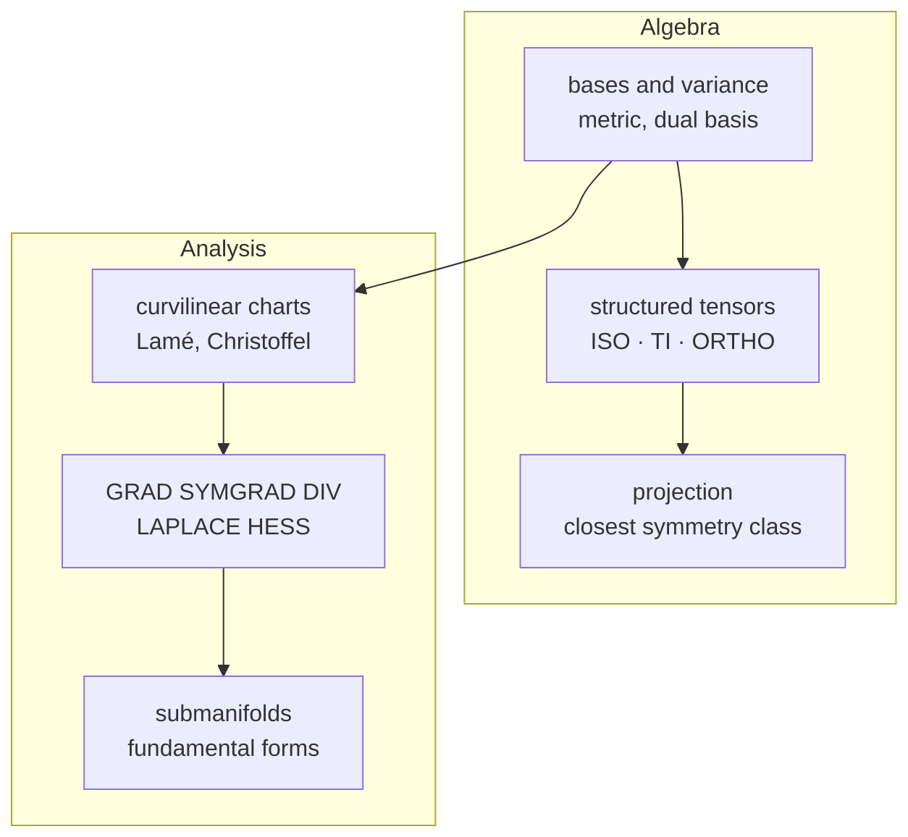
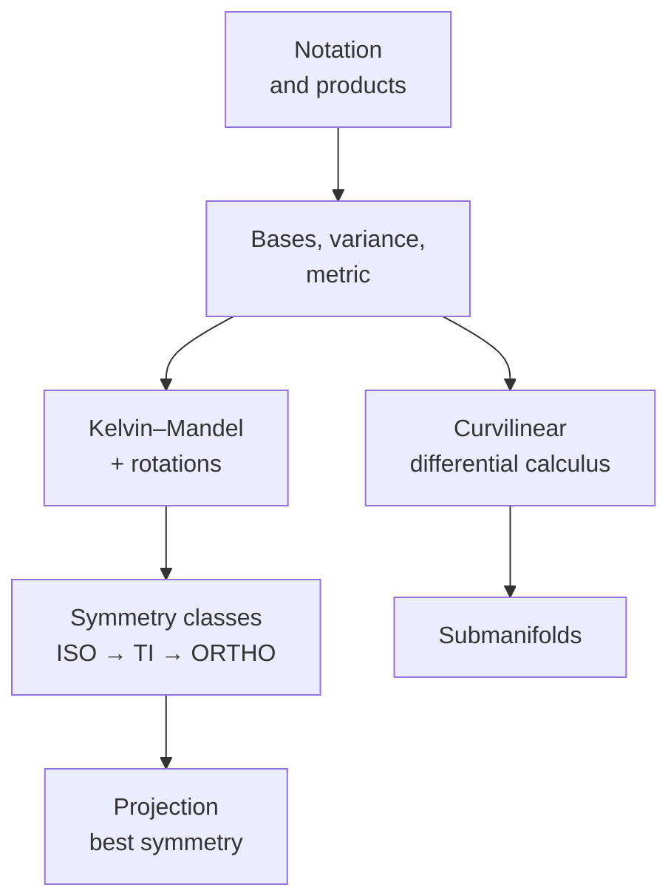

# [Theory — reading path](@id th-index)

## What the package covers

- **Bases** — canonical, rotated, orthogonal or fully general, with covariant
  and contravariant components and the metric that relates them.
- **Tensor algebra** — ``\otimes``, ``\stackrel{s}{\otimes}``, ``\boxtimes``,
  ``\stackrel{s}{\boxtimes}``, and contractions of one, two or four indices.
- **Structured types** — [`TensISO`](@ref), [`TensTI`](@ref),
  [`TensOrtho`](@ref) store 2, 5 and 9 scalars and compute products and inverses
  in closed form, one to three orders of magnitude faster than the dense route.
- **Symmetry projection** — the closest isotropic, transversely isotropic or
  orthotropic tensor, with the orientation given or optimized.
- **Differential operators** in curvilinear coordinates, symbolically or by
  automatic differentiation, plus embedded surfaces.
- **One generic implementation** for `Float64`, `ForwardDiff.Dual`, `SymPy.Sym`
  and `Symbolics.Num`.

The design is inspired by the Maple library
[Tens3d](http://jean.garrigues.perso.centrale-marseille.fr/tens3d.html) of Jean
Garrigues.

`TensND` does two things: it represents tensors of arbitrary order and dimension
on arbitrary bases, and it differentiates tensor fields on arbitrary coordinate
charts. This section states the mathematics behind both, in the order in which
it is built. Every page is self-contained on notation
([Notation and conventions](notation.md)), and every formula is either cited,
derived on the page, or read off the implementation with the source file named.

## The two pillars

**Algebra.** What a tensor is on a general basis, how the products work, how
minor-symmetric tensors are stored as ``6\times6`` matrices, what the symmetry
classes are, and how to project an arbitrary tensor onto one of them.

**Analysis.** How a basis that varies from point to point produces Christoffel
symbols and the five differential operators, and what changes when the chart
describes an embedded surface rather than the whole space.

## Page by page

| Page | What it adds |
| :--- | :----------- |
| [Notation and conventions](notation.md) | typefaces, index conventions, the dictionary from symbol to Julia operator, and the pair-wise double-contraction convention |
| [Tensor algebra](tensor_algebra.md) | ``\otimes``, ``\stackrel{s}{\otimes}``, ``\boxtimes``, ``\stackrel{s}{\boxtimes}``, the contractions, and the identities that make closed-form products possible |
| [Bases and variance](bases_variance.md) | dual basis, metric, covariant/contravariant components, and the basis-type hierarchy that fixes the cost of everything else |
| [Kelvin–Mandel representation](kelvin_mandel.md) | the isometry onto ``6\times6`` matrices, and why its rotation matrix being orthogonal is the whole point |
| [Rotations and Euler angles](rotations.md) | the Z–Y–Z convention as implemented, ``R\stackrel{s}{\boxtimes}R``, and the degeneracies of any three-angle parametrization |
| [Isotropic tensors](isotropic.md) | ``\mathbb{J}``, ``\mathbb{K}``, the ``(\alpha,\beta)`` algebra, isotropization, and why it does not commute with inversion |
| [The Walpole basis](walpole.md) | the six ``\mathbb{W}_i``, the multiplication table, the synthetic ``2\times2`` triplet, and the ``\ell_i`` of ``\mathbb{I},\mathbb{J},\mathbb{K}`` |
| [The extended Walpole algebra](walpole_extended.md) | why the axially invariant space is **eight**-dimensional, and what a five-parameter description silently discards |
| [TI parametrizations](ti_parametrizations.md) | components, engineering constants, Hoenig ratios — three conventions, one class |
| [Orthotropy](orthotropy.md) | nine constants, the block-diagonal matrix, and why a product of two orthotropic tensors needs twelve |
| [Projection onto a symmetry class](projection.md) | normal equations, the condensed objective, the orientation search, and the difference between projecting and averaging |
| [Curvilinear differential calculus](curvilinear.md) | natural basis, Lamé coefficients, Christoffel symbols, the five operators and their index placement |
| [Submanifolds](submanifolds.md) | first and second fundamental forms, Gauss–Weingarten, curvatures |

## Relation to the Echoes manual

The algebraic half of this section is aligned on the appendix of the
[Echoes manual](https://jfbarthelemy.github.io/echoes/): same conventions, same
Walpole basis, same Kelvin–Mandel ordering, overlapping bibliography, so that
expressions can be compared side by side.

Three families of difference are worth knowing in advance.

**Present here, absent there.** The Echoes manual works exclusively in an
orthonormal Cartesian frame and states outright that variance is unnecessary
there. Consequently [Bases and variance](bases_variance.md),
[Curvilinear differential calculus](curvilinear.md) and
[Submanifolds](submanifolds.md) have no counterpart in it and are derived from
scratch here. So is [The extended Walpole algebra](walpole_extended.md), which
as far as we are aware appears in no standard reference.

**Generality.** `TensND` is not restricted to dimension 3, nor to
minor-symmetric order-4 tensors, nor to `Float64`: the same code runs on `Sym`,
`Num` and `ForwardDiff.Dual`. Where a statement holds only in 3-D, it says so.

**Conventions that genuinely differ.** Two are worth flagging because they are
easy to trip over:

- the **spherical coordinates are ordered** ``(\theta,\varphi,r)``, not
  ``(r,\theta,\varphi)``, so that ``\theta=\varphi=0`` reproduces the canonical
  basis in the canonical order ([Curvilinear differential calculus](curvilinear.md));
- the **gradient appends the derivative index on the right**, and the divergence
  contracts the last index — a library using the opposite convention differs by
  a transpose ([Curvilinear differential calculus](curvilinear.md)).

Finally, one claim circulating about the Walpole basis is simply **false** and is
corrected here: ``\mathbb{I}`` is *not* ``\sum_i\mathbb{W}_i``, and
``\mathbb{J}`` is *not* ``\mathbb{W}_1+\mathbb{W}_2``. The correct identities are
on [The Walpole basis](walpole.md) and are pinned by tests.

## Reading path

| Section | For |
| :--- | :--- |
| [Theory](@ref th-index) | the mathematics the library implements, stated once and cited |
| [Manual](@ref man-getting-started) | how to call it, task by task |
| [Tutorials](@ref tut-index) | runnable scripts, each also a notebook |
| [Developer](@ref dev-architecture) | the source layout, and how to extend it |
| [API](@ref api-index) | every exported name, grouped by theme |

Newcomers should start with [Getting started](@ref man-getting-started), then
the tutorial [Bases, variance and the metric](@ref) — variance is the one notion
a Cartesian-only tensor library does without, and everything else rests on it.
