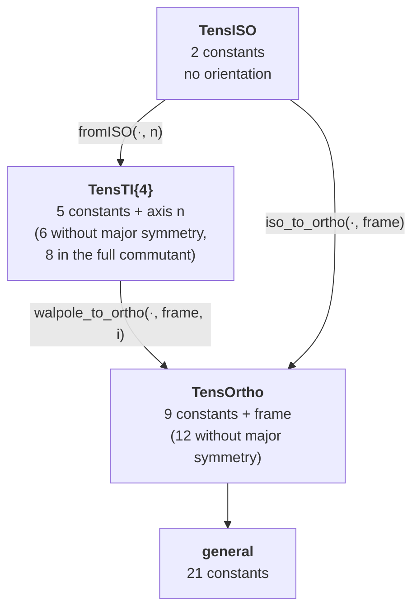

# [Orthotropy](@id th-orthotropy)

Orthotropy is invariance under the reflections through three mutually orthogonal
planes. It is the least constrained class `TensND` gives a dedicated storage
type ([`TensOrtho`](@ref), `src/tens_walpole.jl`): nine constants plus a material
frame, against 21 for a general minor- and major-symmetric tensor.

## The nine constants

Let ``(\underline{e}_1,\underline{e}_2,\underline{e}_3)`` be the orthonormal
**material frame** and ``\boldsymbol{P}_m=\underline{e}_m\otimes\underline{e}_m``
the associated projectors. Then

```math
\begin{aligned}
\mathbb{C}=\;&C_{11}\,\boldsymbol{P}_1{\otimes}\boldsymbol{P}_1
            +C_{22}\,\boldsymbol{P}_2{\otimes}\boldsymbol{P}_2
            +C_{33}\,\boldsymbol{P}_3{\otimes}\boldsymbol{P}_3\\
           &+C_{12}\bigl(\boldsymbol{P}_1{\otimes}\boldsymbol{P}_2
                        +\boldsymbol{P}_2{\otimes}\boldsymbol{P}_1\bigr)
            +C_{13}\bigl(\boldsymbol{P}_1{\otimes}\boldsymbol{P}_3
                        +\boldsymbol{P}_3{\otimes}\boldsymbol{P}_1\bigr)
            +C_{23}\bigl(\boldsymbol{P}_2{\otimes}\boldsymbol{P}_3
                        +\boldsymbol{P}_3{\otimes}\boldsymbol{P}_2\bigr)\\
           &+2C_{44}\,\boldsymbol{P}_2\stackrel{s}{\boxtimes}\boldsymbol{P}_3
            +2C_{55}\,\boldsymbol{P}_1\stackrel{s}{\boxtimes}\boldsymbol{P}_3
            +2C_{66}\,\boldsymbol{P}_1\stackrel{s}{\boxtimes}\boldsymbol{P}_2 .
\end{aligned}
```

## Block-diagonal in the material frame

The whole point of the class is that in its own frame the Kelvin–Mandel matrix
splits:

```math
\mathrm{Mat}_{\text{mat}}(\mathbb{C})=
\begin{pmatrix}
C_{11}&C_{12}&C_{13}&&&\\
C_{12}&C_{22}&C_{23}&&&\\
C_{13}&C_{23}&C_{33}&&&\\
&&&2C_{44}&&\\
&&&&2C_{55}&\\
&&&&&2C_{66}
\end{pmatrix}
=\;
\underbrace{\begin{bmatrix}3\times3\\ \text{symmetric}\end{bmatrix}}_{\text{6 constants}}
\;\oplus\;
\underbrace{\mathrm{diag}(2C_{44},2C_{55},2C_{66})}_{\text{3 constants}}
```

Extension and shear decouple entirely. This is [`KM_material`](@ref); the matrix
in the canonical frame is [`KM`](@ref), and the two are related by the orthogonal
congruence of [Kelvin–Mandel representation](@ref th-kelvin-mandel),

```math
\mathrm{Mat}(\mathbb{C})=Q\;\mathrm{Mat}_{\text{mat}}(\mathbb{C})\;{}^{t}Q ,
```

with ``Q`` built from the frame vectors directly (`_km_congruence`), without
going through Euler angles. Because the two blocks never mix, the closed-form
inverse is one ``3\times3`` inverse plus three reciprocals, and the closed-form
double contraction one ``3\times3`` product plus three scalar products — instead
of two dense 81-component expansions.

## The product of two orthotropic tensors is not orthotropic

The block structure survives a double contraction, but major symmetry does not:

```math
\mathbb{A}:\mathbb{B}\quad\longrightarrow\quad
\underbrace{[3\times3]}_{\text{general, }9}\;\oplus\;
\underbrace{\mathrm{diag}}_{3}
\qquad\Longrightarrow\qquad
\textbf{12 independent constants.}
```

The product of two symmetric ``3\times3`` blocks is symmetric only if they
commute, so ``\mathbb{A}:\mathbb{B}`` is orthotropic *without* major symmetry —
twelve constants where `TensOrtho` stores nine. Rather than introduce a
twelve-parameter container, `TensND` returns the generic `TensCanonical` the
dense route would have produced, and [`is_ORTHO`](@ref) on the result is `false`.

This is the same widening that makes
`TensTI{4,T,5} ⊡ TensTI{4,T,5}` return an `N=6` container
([The Walpole basis](@ref th-walpole)), and it has the same cause: the
**major-symmetric tensors of a class do not form a subalgebra**, only the class
itself does.

When the two operands are expressed in *different* material frames the product is
generally fully anisotropic, and the implementation falls back to the generic
route bit for bit.

## Where the classes sit



Each arrow is an **exact** re-expression, not an approximation: an isotropic
tensor really is transversely isotropic about every axis, and a transversely
isotropic one really is orthotropic in any frame containing its axis. The
converse direction — pushing an arbitrary tensor *down* the chain — is
approximation, and is the subject of
[Projection onto a symmetry class](@ref th-projection).

The promotions are implemented in `src/structured_tens_promotion.jl` and are
what allow mixed-class arithmetic (`TensISO ⊡ TensOrtho`, `TensTI{2} ⊡ TensTI{4}`)
to stay in closed form.

## Order 2

An order-2 orthotropic tensor is simply one that is diagonal in the material
frame,

```math
\boldsymbol{a}=a_1\,\boldsymbol{P}_1+a_2\,\boldsymbol{P}_2+a_3\,\boldsymbol{P}_3 ,
```

i.e. three constants and a frame. Every symmetric order-2 tensor is orthotropic
in its own eigenframe — which is why order-2 orthotropy is never an interesting
*hypothesis*, only a useful *representation*. The corresponding projection at
fixed frame is therefore just "keep the diagonal", as
[Projection onto a symmetry class](@ref th-projection) makes explicit.
